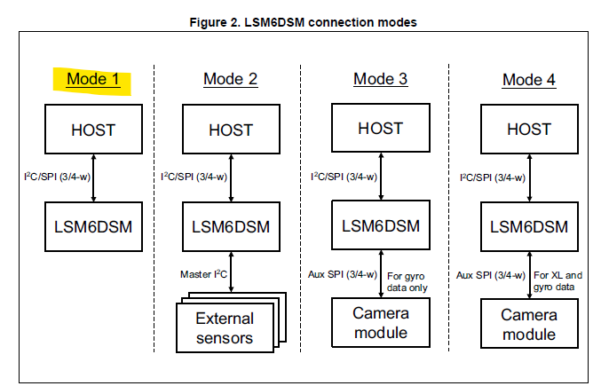
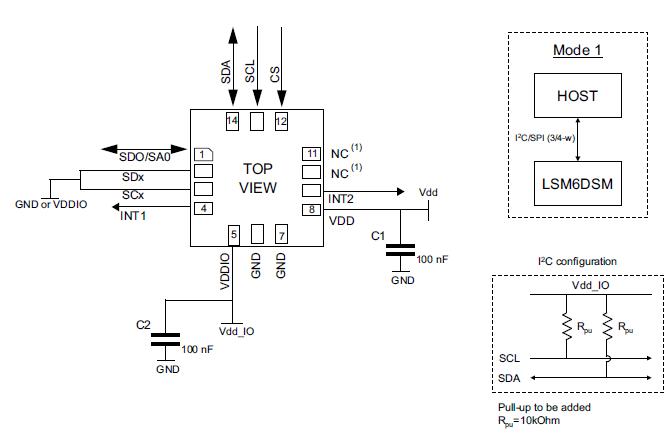
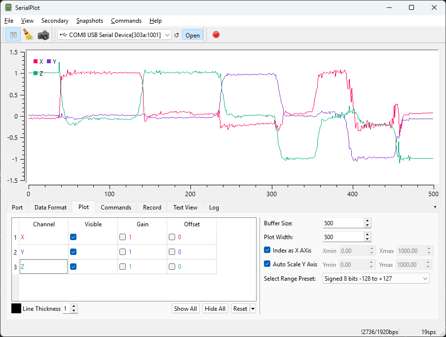
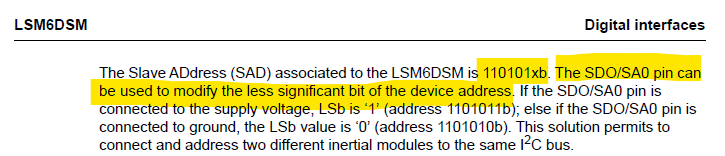

# LSM6DSM IMU Library (ESP32 + Arduino)

An Arduino-compatible library for interfacing with the **ST LSM6DSM** I²C 6-axis inertial measurement unit (IMU), supporting **accelerometer**, **gyroscope**, and **interrupt-driven motion detection**.

## Key Features

- Configurable accelerometer and gyroscope (scale, ODR)
- Wake-up detection with g-threshold and duration
- Flexible interrupt routing (INT1 or INT2)
- Data-ready and wake-up support for ultra-low-power modes
- Optional high-pass filter for wake-up motion

---

## Basic Usage

```cpp

LSM6DSM imu;
volatile bool motionDetected = false;

void IRAM_ATTR onMotionInterrupt() {
    motionDetected = true;
}

void setup() {
    Serial.begin(19200);

    pinMode(IMU_SA0, OUTPUT); digitalWrite(IMU_SA0, LOW);
    pinMode(IMU_CS, OUTPUT);  digitalWrite(IMU_CS, HIGH);
    pinMode(IMU_INT_PIN, INPUT_PULLUP);
    attachInterrupt(IMU_INT_PIN, onMotionInterrupt, RISING);

    Wire.begin(48, 47); // SDA, SCL

    imu.begin();

    imu.configure(
    LSM6DSM::AFS_2G,
    LSM6DSM::GFS_1000DPS,
    LSM6DSM::ODR_208Hz,
    LSM6DSM::ODR_208Hz,
    nullptr,
    nullptr);

    imu.enableWakeUpInterrupt(0.3, 1, LSM6DSM::INT1);
}

void loop() {

    float ax, ay, az, gx, gy, gz;
    imu.readData(ax, ay, az, gx, gy, gz);
    Serial.print(ax);
    Serial.print(",");
    Serial.print(ay);
    Serial.print(",");
    Serial.println(az);

    if (motionDetected) {
        motionDetected = false;
        Serial.println("Wake-up interrupt triggered!");
    }

    delay(50);
}
```

---

## IMU Operating Modes



> This library supports only **Mode 1** and **I²C communication**. SPI mode and advanced configurations are not implemented.

---

## Basic Circuit



> To use I²C mode and the default address `0x6A`, configure your board as follows:

```cpp
digitalWrite(IMU_SA0, LOW);  // LOW = 0x6A, HIGH = 0x6B
digitalWrite(IMU_CS, HIGH);  // HIGH = I²C, LOW = SPI (not supported)
```


---

## Serial Plot Example



---

## I²C Address Selection



> The I²C address is determined by the **SA0 pin**:  
> **LOW = `0x6A`**, **HIGH = `0x6B`**

---

## Compatibility

This library was tested with:

- **ESP32 Arduino Core v3.2.0**  
  Based on **ESP-IDF v5.4.1**  
  [GitHub Release: espressif/arduino-esp32 v3.2.0](https://github.com/espressif/arduino-esp32/releases/tag/3.2.0)
